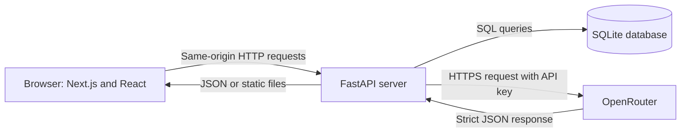
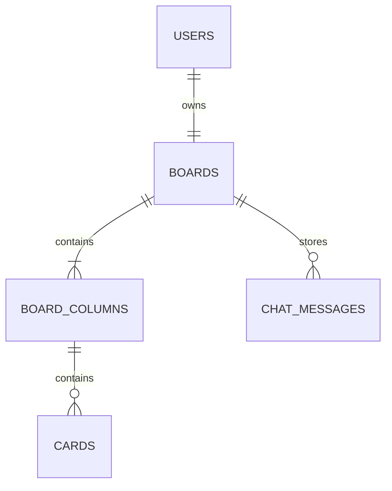

# Building the Project Management MVP: A Beginner's Tutorial

## Introduction

This tutorial explains the Project Management MVP in this repository from the ground up. It is written for someone who is completely new to coding, web development, databases, Docker, and AI APIs.

The finished application lets a user:

- sign in with the MVP credentials `user` and `password`;
- view one persistent Kanban board;
- rename the five fixed columns;
- create, edit, delete, reorder, and move cards;
- ask an AI assistant to create, edit, move, or delete several cards at once;
- keep the login, board, and chat history after refreshing or restarting the browser; and
- run the entire application locally in one Docker container.

The code deliberately stays small and direct. It is an MVP, or **minimum viable product**: enough functionality to prove the product works without adding every feature that a production application would eventually need.

By the end of this tutorial, you should understand:

1. how the browser, backend, database, and AI service communicate;
2. why the frontend and backend use different programming languages;
3. how authentication and persistent cookies work;
4. how SQLite stores users, boards, columns, cards, and chat messages;
5. how board updates remain ordered and transactional;
6. how the AI is constrained to a safe JSON response format;
7. how React turns API data into an interactive interface;
8. how Docker packages everything into one local application; and
9. how automated tests protect the behavior.

## 1. The technology in plain language

### Technology summary

| Technology | Where it is used | What it does |
| --- | --- | --- |
| HTML and CSS | Frontend output | Define the page structure and visual appearance. |
| TypeScript | `frontend/` | Adds types to JavaScript so many mistakes are caught before the app runs. |
| React | `frontend/src/` | Builds the interface from reusable components and keeps it synchronized with state. |
| Next.js | `frontend/` | Organizes the React application and exports it as static browser files. |
| Tailwind CSS | Frontend components | Provides small CSS utility classes for layout, color, spacing, and responsive design. |
| dnd-kit | Kanban components | Implements accessible drag-and-drop behavior. |
| Python | `backend/` | Implements the web server, business logic, database access, and AI integration. |
| FastAPI | `backend/app/` | Maps HTTP requests such as `GET /api/board` to Python functions. |
| Pydantic | Backend request and response models | Validates incoming JSON and produces typed outgoing JSON. |
| SQLite | `data/project_management.db` | Stores persistent application data in one local file. |
| httpx | `backend/app/openrouter.py` | Sends HTTP requests from the backend to OpenRouter. |
| OpenRouter | External service | Sends prompts to the `openai/gpt-oss-120b` AI model. |
| uv | `backend/` and Docker | Installs and locks Python dependencies reproducibly. |
| Docker | Project root | Packages the built frontend and Python backend into one runnable container. |
| Docker Compose | `compose.yaml` | Defines the port, environment file, persistent data volume, and build command. |
| Vitest and Testing Library | Frontend unit tests | Test React components and the typed API client without a real browser. |
| Playwright | Frontend browser tests | Drives a real browser through login, board, persistence, drag, and chat flows. |
| pytest | Backend tests | Tests authentication, database behavior, board APIs, transactions, and AI integration. |

The exact dependency versions are recorded in `frontend/package-lock.json` and `backend/uv.lock`. The Docker build currently uses Node.js 24 for the frontend build and Python 3.13 for the backend runtime.

### A few beginner definitions

- **Frontend:** code that runs in the user's browser.
- **Backend:** code that runs on the server and controls protected logic and data.
- **API:** a set of URLs that programs use to communicate. For example, the frontend calls `GET /api/board` to request the board.
- **HTTP request:** a message sent to a server. Common methods include `GET` for reading, `POST` for creating or performing an action, `PATCH` for editing, and `DELETE` for deleting.
- **JSON:** a text format for structured data. It looks similar to JavaScript objects.
- **Database:** organized, persistent storage that survives application restarts.
- **Cookie:** a small value the browser stores and automatically sends to the server.
- **Component:** a reusable piece of a React interface.
- **State:** data currently held by a running interface, such as the loaded board or whether a request is still sending.
- **Transaction:** a group of database changes that either all succeed or all roll back.
- **Container:** an isolated package containing the application and its runtime dependencies.

## 2. The high-level architecture

The whole system can be pictured like this:



There is only one public local address:

```text
http://localhost:8000
```

FastAPI serves two kinds of content from that address:

- `/api/...` URLs return JSON from backend functions.
- Every other path serves the exported Next.js frontend.

This is called a **same-origin architecture**. The frontend and API share the same scheme, host, and port. That makes cookies straightforward and avoids needing Cross-Origin Resource Sharing, usually called CORS.

### What happens when the application starts

1. Docker Compose reads `compose.yaml`.
2. Docker builds the frontend into static files.
3. Docker installs the Python application and copies those static files into the final image.
4. Uvicorn starts FastAPI on port 8000.
5. FastAPI initializes the SQLite database if necessary.
6. The browser requests `/` and receives the static frontend.
7. React starts in the browser and requests the current login session.

### What happens when a user edits a card

1. The user clicks **Edit** and submits a changed title or description.
2. React calls `PATCH /api/cards/{card_id}` with JSON.
3. FastAPI verifies the session cookie.
4. FastAPI verifies that the card belongs to the signed-in user's board.
5. SQLite updates the card inside a transaction.
6. FastAPI returns the complete refreshed board.
7. React replaces its board state, so the screen immediately matches the database.

### What happens when a user asks the AI to change the board

1. React sends the message to `POST /api/chat`.
2. FastAPI loads the current board and that board's conversation history.
3. FastAPI sends the board, history, new message, and a strict JSON Schema to OpenRouter.
4. OpenRouter returns an assistant message and zero or more card operations.
5. Pydantic validates the response before any database change is made.
6. FastAPI opens one transaction, saves the user message, applies every operation, and saves the assistant message.
7. If one operation is invalid, the transaction rolls everything back.
8. If all operations work, FastAPI returns the saved assistant message and refreshed board.
9. React displays the messages and immediately replaces the board on screen.

## 3. Repository tour

The important folders and files are:

```text
pm/
|-- AGENTS.md                 Project requirements and coding rules
|-- README.md                 Short run and test instructions
|-- tutorial.md               This tutorial
|-- Dockerfile                Builds the frontend and final server image
|-- compose.yaml              Runs the container, port, environment, and volume
|-- .env                      Local secrets; ignored by Git
|-- data/                     Persistent SQLite data; ignored by Git
|-- docs/
|   |-- PLAN.md               The completed implementation plan
|   |-- DATABASE.md           Human-readable database design
|   `-- database-schema.json  Machine-readable database design
|-- scripts/
|   |-- start.ps1             Windows start script
|   |-- stop.ps1              Windows stop script
|   |-- start.sh              macOS/Linux start script
|   `-- stop.sh               macOS/Linux stop script
|-- backend/
|   |-- pyproject.toml        Python dependencies and pytest configuration
|   |-- uv.lock               Exact locked Python dependencies
|   |-- app/
|   |   |-- main.py           FastAPI application assembly
|   |   |-- auth.py           Login, session cookie, and logout
|   |   |-- database.py       SQLite schema, connections, and seed data
|   |   |-- board.py          Board API and card ordering logic
|   |   |-- openrouter.py     OpenRouter HTTP client
|   |   `-- chat.py           AI prompt, response validation, and transaction
|   `-- tests/                Backend automated tests
`-- frontend/
    |-- package.json          JavaScript dependencies and commands
    |-- next.config.ts        Static export configuration
    |-- src/
    |   |-- app/              Next.js page, layout, and global CSS
    |   |-- components/       Login, board, cards, columns, and chat UI
    |   `-- lib/              API client and Kanban data helpers
    `-- tests/                Playwright browser tests
```

Files such as `.next/`, `out/`, `node_modules/`, `.venv/`, `.env`, and `data/` are generated or machine-specific. They are ignored by Git and should not be committed.

## 4. Running the application

### Requirements

For the normal Docker workflow, install:

- Docker Desktop on Windows or macOS, or Docker Engine on Linux; and
- Git if you want to version the source code.

The project root must contain an `.env` file with an OpenRouter key:

```dotenv
OPENROUTER_API_KEY=your-key-here
```

Do not paste the real key into source code or commit `.env`.

### Start on Windows

From PowerShell in the project root:

```powershell
./scripts/start.ps1
```

### Start on macOS or Linux

```sh
sh scripts/start.sh
```

Then open <http://localhost:8000> and sign in with:

```text
Username: user
Password: password
```

### Stop the application

Windows:

```powershell
./scripts/stop.ps1
```

macOS or Linux:

```sh
sh scripts/stop.sh
```

Stopping removes the container, but the database remains in `data/project_management.db` because that folder is mounted as a Docker volume.

## 5. Infrastructure code review

### 5.1 The multi-stage Docker build

The `Dockerfile` uses two stages. The first stage builds the frontend:

```dockerfile
FROM node:24-alpine AS frontend-build

WORKDIR /frontend
COPY frontend/package.json frontend/package-lock.json ./
RUN npm ci

COPY frontend/ ./
RUN npm run build
```

Important ideas:

- `FROM node:24-alpine` starts with a small image containing Node.js.
- `WORKDIR` chooses the current folder inside the image.
- `npm ci` installs exactly what is recorded in `package-lock.json`.
- `npm run build` runs Next.js and creates static files in `frontend/out/`.

The second stage creates the actual runtime image:

```dockerfile
FROM ghcr.io/astral-sh/uv:python3.13-bookworm-slim

ENV STATIC_DIRECTORY=/app/static \
    DATABASE_PATH=/app/data/project_management.db

WORKDIR /app
COPY backend/pyproject.toml backend/uv.lock ./
RUN uv sync --frozen --no-dev

COPY backend/app ./app
COPY --from=frontend-build /frontend/out ./static

CMD ["uv", "run", "--frozen", "--no-sync", "uvicorn", "app.main:app", "--host", "0.0.0.0", "--port", "8000"]
```

This is called a **multi-stage build**. Node.js is needed to build the frontend but is not needed while the finished application runs. The final image therefore contains Python, FastAPI, and the already-built browser files, but no Node.js server.

### 5.2 Docker Compose

`compose.yaml` describes how to run the image:

```yaml
services:
  app:
    build: .
    ports:
      - "8000:8000"
    env_file:
      - .env
    volumes:
      - ./data:/app/data
```

Line by line:

- `build: .` tells Docker to use the root `Dockerfile`.
- `8000:8000` maps local port 8000 to container port 8000.
- `env_file` loads secrets into the container's environment.
- `./data:/app/data` maps the local data folder to the container data folder.

Without the volume, deleting the container would also delete its SQLite file. With the volume, the data belongs to the local project folder and survives container replacement.

## 6. Backend code review

### 6.1 Creating the FastAPI application

The central backend file is `backend/app/main.py`:

```python
app = FastAPI(title="Project Management MVP", version="0.1.0", lifespan=lifespan)
app.include_router(auth_router)
app.include_router(board_router)
app.include_router(chat_router)
app.include_router(openrouter_router)
```

A **router** is a group of related API URLs. Authentication, board operations, chat, and connectivity live in separate files, while `main.py` assembles them into one application.

The lifespan function initializes the database when FastAPI starts:

```python
@asynccontextmanager
async def lifespan(_: FastAPI) -> AsyncIterator[None]:
    initialize_database()
    yield
```

Finally, FastAPI mounts the static frontend after the API routes:

```python
app.mount(
    "/",
    StaticFiles(directory=static_directory, html=True, check_dir=False),
    name="frontend",
)
```

Route order matters. The `/api/...` routes are registered first. The catch-all static frontend is mounted last, so it cannot accidentally hide an API endpoint.

### 6.2 SQLite schema and initialization

`backend/app/database.py` defines the schema. The main relationships are:



The important database rules are:

- usernames are unique;
- each user can own only one board because `boards.user_id` is unique;
- each board has five column positions, numbered 0 through 4;
- each card position is unique inside its column;
- chat message roles can only be `user` or `assistant`; and
- deleting a parent automatically deletes its children through `ON DELETE CASCADE`.

The connection helper is small but important:

```python
@contextmanager
def connect() -> Iterator[sqlite3.Connection]:
    connection = sqlite3.connect(database_path())
    connection.row_factory = sqlite3.Row
    connection.execute("PRAGMA foreign_keys = ON")
    connection.execute("PRAGMA busy_timeout = 5000")
    try:
        yield connection
    except Exception:
        connection.rollback()
        raise
    else:
        connection.commit()
    finally:
        connection.close()
```

When code uses `with connect() as connection`, four things happen:

1. a database connection opens;
2. the calling function performs reads or writes;
3. success commits all changes, while an exception rolls them back; and
4. the connection always closes.

This pattern prevents forgotten commits, forgotten closes, and partially saved operations.

Initialization is **idempotent**, meaning it is safe to run repeatedly. `CREATE TABLE IF NOT EXISTS` does not duplicate tables, and `INSERT OR IGNORE` does not duplicate the MVP user or board. The eight demo cards are added only when the board has no cards.

### 6.3 Authentication and persistent login

The MVP credentials are fixed to `user` and `password`, but the plaintext password is used only while seeding the initial database. `backend/app/database.py` stores a salted `scrypt` hash:

```python
digest = hashlib.scrypt(password.encode(), salt=salt, n=16384, r=8, p=1)
encoded_hash = f"scrypt${salt.hex()}${digest.hex()}"
```

Login loads the matching database user and verifies the submitted password against the stored hash. The plaintext password is never stored in SQLite.

After a successful login, the backend creates a signed token containing the username and expiration time:

```python
payload = f"{username}:{expires_at}"
signature = hmac.new(
    _session_secret(), payload.encode(), hashlib.sha256
).hexdigest()
token = base64.urlsafe_b64encode(f"{payload}:{signature}".encode()).decode()
```

HMAC creates a signature that can only be reproduced with the server secret. A user can read the token, but changing the username or expiration invalidates the signature.

The server stores the token in a cookie:

```python
response.set_cookie(
    key=SESSION_COOKIE,
    value=create_session_token(user["username"]),
    max_age=SESSION_MAX_AGE,
    expires=datetime.now(UTC) + timedelta(seconds=SESSION_MAX_AGE),
    httponly=True,
    samesite="lax",
)
```

- `max_age` and `expires` make the cookie survive refreshes and browser restarts.
- `httponly=True` prevents browser JavaScript from reading it.
- `samesite="lax"` reduces some cross-site request risks.

Every protected endpoint depends on `authenticated_user`. It reads the cookie, checks the signature and expiration, confirms that the signed user still exists in SQLite, and returns HTTP 401 when authentication fails.

### 6.4 Board request and response models

Pydantic models describe valid data:

```python
class Card(BaseModel):
    id: str
    title: str
    details: str


class Column(BaseModel):
    id: str
    title: str
    cardIds: list[str]


class Board(BaseModel):
    id: str
    title: str
    columns: list[Column]
    cards: dict[str, Card]
```

The API sends card IDs separately in each column and stores full card objects in a dictionary. A simplified response looks like this:

```json
{
  "id": "1",
  "title": "Kanban Studio",
  "columns": [
    {
      "id": "1",
      "title": "Backlog",
      "cardIds": ["1", "2"]
    }
  ],
  "cards": {
    "1": {
      "id": "1",
      "title": "Align roadmap themes",
      "details": "Draft quarterly themes with impact statements and metrics."
    }
  }
}
```

This shape is convenient for React: columns control ordering, while cards can be found quickly by ID.

### 6.5 Ownership checks

The application currently seeds one fixed MVP login, but its authentication and database paths support multiple users. Board queries start from the authenticated username:

```sql
SELECT boards.id
FROM boards
JOIN users ON users.id = boards.user_id
WHERE users.username = ?
```

Card ownership is checked by joining cards through columns to the user's board. This prevents a future user from editing another user's card merely by guessing its ID.

The `?` in SQL is a parameter placeholder. Values are supplied separately instead of being joined into the SQL text. This prevents SQL injection.

### 6.6 Keeping card positions valid

Cards have zero-based positions inside a column:

```text
0, 1, 2, 3, ...
```

The database requires each `(column_id, position)` pair to be unique. Moving a card directly from position 0 to position 1 could temporarily collide with the card already at position 1.

The `_rewrite_positions` helper avoids that collision by first shifting the old positions beyond the current range, then writing the final contiguous positions. Creation, deletion, same-column movement, and cross-column movement all use one transaction, so the database never commits a half-reordered board.

Every successful mutation returns the complete refreshed board. That keeps the frontend simple and makes the backend the single source of truth.

### 6.7 Calling OpenRouter

`backend/app/openrouter.py` is the only module that knows the API URL and secret:

```python
OPENROUTER_URL = "https://openrouter.ai/api/v1/chat/completions"
OPENROUTER_MODEL = "openai/gpt-oss-120b"
```

The key is read from the server environment:

```python
api_key = os.getenv("OPENROUTER_API_KEY", "").strip()
if not api_key:
    raise OpenRouterConfigurationError(
        "OPENROUTER_API_KEY is not configured on the server"
    )
```

The frontend never receives the key. The backend places it in the outgoing authorization header:

```python
headers={
    "Authorization": f"Bearer {api_key}",
    "Content-Type": "application/json",
    "X-OpenRouter-Title": "Project Management MVP",
}
```

Errors are deliberately sanitized. For example, an upstream HTTP failure becomes `OpenRouter request failed with HTTP 503`; the response body and secret are not copied to the browser. Retryable network failures and HTTP 429, 502, and 503 responses receive one bounded retry, using a numeric `Retry-After` value when OpenRouter supplies one.

The normal test suite uses an HTTP mock and never spends API credits. A separate live test must be enabled explicitly.

### 6.8 Constraining AI output with JSON Schema

Free-form model text is not safe to execute as database instructions. The application instead asks for a strict object:

```python
class AiBoardUpdate(BaseModel):
    model_config = ConfigDict(extra="forbid")

    message: str
    operations: list[CardOperation]
```

Each operation has one of three types: `create`, `edit`, or `move`. All fields exist, but fields that do not apply must be `null`. A create operation looks like this:

```json
{
  "type": "create",
  "card_id": null,
  "column_id": 1,
  "position": null,
  "title": "Prepare launch checklist",
  "details": "List release, documentation, and announcement tasks."
}
```

An edit operation identifies an existing card:

```json
{
  "type": "edit",
  "card_id": 4,
  "column_id": null,
  "position": null,
  "title": "Refine board status language",
  "details": null
}
```

A move operation identifies a card, target column, and zero-based position:

```json
{
  "type": "move",
  "card_id": 4,
  "column_id": 3,
  "position": 0,
  "title": null,
  "details": null
}
```

Pydantic rejects extra fields, blank messages, invalid IDs, negative positions, and field combinations that do not match the operation type.

The schema is sent to OpenRouter with strict mode:

```python
AI_RESPONSE_FORMAT = {
    "type": "json_schema",
    "json_schema": {
        "name": "board_update",
        "strict": True,
        "schema": AiBoardUpdate.model_json_schema(),
    },
}
```

This gives two layers of protection:

1. OpenRouter asks the model to follow the schema.
2. The backend validates the returned JSON again before using it.

### 6.9 Building the AI conversation

`backend/app/chat.py` builds the model messages in this order:

```python
messages = [
    {
        "role": "system",
        "content": f"{SYSTEM_PROMPT}\n\nCurrent board JSON:\n{board_json}",
    },
    *saved_history,
    {"role": "user", "content": request.message},
]
```

The system message explains the allowed behavior and contains the latest board. Previous user and assistant messages preserve conversational context. The new user message comes last. The complete history remains stored and available to the UI, while only the latest 50 saved messages are sent to OpenRouter to bound request size and cost.

The external HTTP call happens before the write transaction. This is important: a network request may take several seconds, and the application should not hold a SQLite write lock while waiting.

After the AI response is validated, one transaction performs the durable work:

```python
with connect() as connection:
    board_id = board_id_for_user(connection, user.username)
    _insert_message(connection, board_id, "user", request.message)
    for operation in update.operations:
        _apply_operation(connection, board_id, operation)
    assistant_message = _insert_message(
        connection, board_id, "assistant", update.message
    )
    refreshed_board = read_board(connection, user.username)
```

If operation three fails after operations one and two appeared to work, an exception leaves the `with` block. The connection helper rolls back operations one and two and both messages. This is the all-or-nothing guarantee of a transaction.

## 7. Frontend code review

### 7.1 Static Next.js export

The entire Next.js configuration is:

```typescript
const nextConfig: NextConfig = {
  output: "export",
};
```

Next.js normally runs its own server. `output: "export"` instead creates ordinary HTML, CSS, and JavaScript files. FastAPI serves those files, which is how the project runs from one process and one container.

### 7.2 Session state on the home page

`frontend/src/app/page.tsx` uses one state value with three meanings:

```typescript
const [user, setUser] = useState<User | null>();
```

- `undefined` means the session request is still loading.
- `null` means no user is signed in.
- a `User` object means authentication succeeded.

That produces three interface states:

```typescript
if (user === undefined) {
  return <p>Loading workspace...</p>;
}

if (!user) {
  return <LoginForm ... />;
}

return <KanbanBoard username={user.username} onLogout={handleLogout} />;
```

On initial page load, `getSession()` asks the backend whether the cookie is valid. A 401 shows the login form. A valid cookie goes straight to the board, which is why login survives refreshes and browser restarts.

### 7.3 The typed API client

`frontend/src/lib/api.ts` centralizes all HTTP calls. Its generic helper is:

```typescript
const request = async <T>(path: string, options?: RequestInit): Promise<T> => {
  const response = await fetch(path, {
    ...options,
    credentials: "include",
    headers: options?.body
      ? { "Content-Type": "application/json", ...options.headers }
      : options?.headers,
  });

  if (!response.ok) {
    const body = (await response.json()) as { detail?: string };
    throw new ApiError(body.detail ?? "Request failed", response.status);
  }

  return response.status === 204
    ? (undefined as T)
    : ((await response.json()) as T);
};
```

`<T>` means the caller chooses the expected result type. For example:

```typescript
export const getBoard = () => request<BoardData>("/api/board");
```

TypeScript then knows that `await getBoard()` returns a `BoardData` object.

`credentials: "include"` tells the browser to send the session cookie. JSON requests automatically receive the correct `Content-Type` header. Backend error details become `ApiError` instances that components can display.

### 7.4 Board state and backend synchronization

`KanbanBoard` owns the current board:

```typescript
const [board, setBoard] = useState<BoardData | null>(initialBoard ?? null);
```

When there is no test-provided initial board, `useEffect` loads it from the backend. Mutations use one helper:

```typescript
const applyMutation = async (
  operation: () => Promise<BoardData>
): Promise<boolean> => {
  setError(null);
  try {
    setBoard(await operation());
    return true;
  } catch (mutationError) {
    setError(errorMessage(mutationError));
    return false;
  }
};
```

This helper provides consistent behavior for rename, create, edit, and delete:

- clear an old error;
- make the API request;
- replace state with the backend's complete response; or
- show an error and report failure.

### 7.5 Optimistic drag-and-drop

Dragging is handled slightly differently. The board first updates locally so the interaction feels immediate:

```typescript
const previousBoard = board;
setBoard({ ...board, columns: nextColumns });
```

It then asks the backend to save the move. If saving fails, it restores the old board:

```typescript
const saved = await applyMutation(() =>
  moveCardRequest(cardId, targetColumn.id, targetPosition)
);
if (!saved) setBoard(previousBoard);
```

This is called an **optimistic update**. The UI assumes success for responsiveness but retains enough information to roll back.

The drag listeners are attached to a dedicated **Drag** button on each card. That keeps editing and other card clicks separate from drag gestures.

### 7.6 The chat sidebar

`ChatSidebar` owns only chat-related state:

```typescript
const [messages, setMessages] = useState<ChatMessage[]>([]);
const [draft, setDraft] = useState("");
const [isLoading, setIsLoading] = useState(true);
const [isSending, setIsSending] = useState(false);
const [error, setError] = useState<string | null>(null);
```

It receives one callback:

```typescript
type ChatSidebarProps = {
  onBoardUpdate: (board: BoardData) => void;
};
```

This is a useful React design decision. `ChatSidebar` does not create another board store. `KanbanBoard` remains the single owner, and the chat simply hands back a refreshed board.

The component loads history once after mounting:

```typescript
useEffect(() => {
  getChatHistory()
    .then(setMessages)
    .catch(() => setError("Unable to load chat history."));
}, []);
```

The real implementation also guards against setting state after the component unmounts and provides a retry action.

Submitting a message follows this sequence:

```typescript
const response = await sendChatMessage(message);
setMessages((current) => [
  ...current,
  response.user_message,
  response.message,
]);
setDraft("");
onBoardUpdate(response.board);
```

Both messages use their real database IDs returned by the server. The draft is cleared only after success. On failure, the error is shown and the user's text remains in the input, making retry easier. The conversation automatically scrolls to the newest activity.

The sidebar is sticky on wide screens and stacks under the horizontally scrollable board on smaller screens. Tailwind responsive classes such as `xl:sticky` and `xl:grid-cols-[...]` apply styles only at the specified breakpoint.

### 7.7 Accessibility choices

The interface includes several accessibility features:

- visible labels for username, password, column titles, card editing, and chat;
- semantic buttons instead of clickable generic elements;
- `role="alert"` for errors;
- `role="status"` for the AI sending message;
- `aria-live="polite"` for conversation updates;
- a dedicated keyboard-focusable drag handle; and
- disabled submit controls while work is in progress.

Accessibility is not a one-time feature, but these choices provide a sound MVP foundation.

## 8. API reference

All protected endpoints require the `pm_session` cookie.

| Method | Path | Purpose |
| --- | --- | --- |
| `GET` | `/api/health` | Confirm that the backend is running. |
| `POST` | `/api/auth/login` | Validate MVP credentials and set the cookie. |
| `GET` | `/api/auth/session` | Return the current signed-in user. |
| `POST` | `/api/auth/logout` | Clear the session cookie. |
| `GET` | `/api/board` | Return the signed-in user's board. |
| `PATCH` | `/api/columns/{id}` | Rename an owned column. |
| `POST` | `/api/cards` | Add a card to an owned column. |
| `PATCH` | `/api/cards/{id}` | Edit an owned card. |
| `DELETE` | `/api/cards/{id}` | Delete an owned card and close its position gap. |
| `POST` | `/api/cards/{id}/move` | Move or reorder an owned card. |
| `GET` | `/api/chat` | Return the board's saved conversation history. |
| `POST` | `/api/chat` | Ask the AI and atomically apply its card operations. |
| `POST` | `/api/ai/connectivity` | Make the explicit `2+2` connectivity request. |

Common response codes include:

- `200`: successful request;
- `201`: card created;
- `204`: successful request with no response body, used for logout;
- `401`: authentication required or credentials invalid;
- `404`: an owned board resource was not found;
- `422`: request validation or AI operation failed;
- `502`: OpenRouter failed or returned an invalid result; and
- `503`: the server is missing `OPENROUTER_API_KEY`.

## 9. Automated testing

The project uses three test levels.

### 9.1 Backend tests with pytest

Backend tests create a separate temporary database for each test:

```python
@pytest.fixture
def client(tmp_path, monkeypatch):
    monkeypatch.setenv(
        "DATABASE_PATH",
        str(tmp_path / "project_management.db"),
    )
    with TestClient(app) as test_client:
        yield test_client
```

This prevents tests from changing the real `data/project_management.db`.

The backend suite proves:

- login cookies persist and tampered tokens fail;
- database initialization is idempotent;
- every board endpoint enforces authentication and ownership;
- positions stay contiguous after create, move, and delete;
- OpenRouter requests use the expected model, headers, and schema;
- secrets are not copied into errors;
- chat prompts include the board, scoped history, and new message; and
- invalid later AI operations roll back earlier operations and both messages.

Run it with:

```sh
cd backend
uv run pytest
```

The paid connectivity test is skipped unless explicitly enabled:

```sh
uv run --env-file ../.env pytest -m live --run-openrouter-live
```

### 9.2 Frontend unit tests with Vitest

Vitest and Testing Library render components in a simulated browser environment. API functions are replaced with mocks, so tests can force success, loading, and error cases.

The component tests cover:

- board loading and retry;
- column rename;
- card create, edit, delete, and cancel;
- chat history loading and retry;
- the AI sending state;
- preserving the draft after a failed send; and
- replacing the board after a successful AI response.

Run them with:

```sh
cd frontend
npm run test:unit
```

### 9.3 Browser tests with Playwright

Playwright launches Chromium and uses the application as a user would. It verifies:

- unauthenticated protection;
- invalid and valid login;
- login persistence across refresh and a recreated browser context;
- persistent card creation, editing, and deletion;
- persistent column rename;
- persistent drag-and-drop;
- chat history, sending, and immediate board refresh; and
- logout protection.

The chat browser test intercepts `/api/chat` and returns a controlled response. This exercises the real browser UI without spending OpenRouter credits or making tests depend on an external service.

Run it with:

```sh
cd frontend
npm run test:e2e
```

## 10. A practical debugging walkthrough

When something goes wrong, trace the request one layer at a time instead of guessing.

### Example: a card does not save

1. Look for the red error message in the UI.
2. Open browser developer tools and select the **Network** tab.
3. Find the `/api/cards/...` request.
4. Check the HTTP method, JSON body, status code, and response detail.
5. If the response is 401, investigate the session cookie.
6. If it is 404, investigate ownership and the requested ID.
7. If it is 422, inspect request validation or target position.
8. If it is 500, inspect FastAPI container logs with `docker compose logs`.
9. Add or run the smallest backend test that reproduces the problem.
10. Fix the proven root cause, then rerun unit, browser, and container checks as appropriate.

### Example: AI chat fails

1. Confirm `.env` contains `OPENROUTER_API_KEY`.
2. Confirm the key is available inside Docker through `env_file` without printing it.
3. Check whether the API returned 502 or 503.
4. A 503 means local configuration is missing.
5. A 502 means OpenRouter was unavailable, rejected the request, or returned invalid output.
6. Retry transient upstream failures; the UI preserves the draft for this reason.
7. Run mocked tests first because they are deterministic and free.
8. Run the explicit live connectivity test only when an external integration check is needed.

## 11. Why the main design choices fit this MVP

### One complete board response after every mutation

Returning the whole board uses a little more network data than returning only the changed card. For one small local board, that tradeoff is worthwhile: it eliminates complicated frontend reconciliation and keeps the database authoritative.

### SQLite instead of a database server

SQLite needs no extra service, credentials, or network configuration. It is ideal for one local container and small data volume. The schema still models multiple users so a future database can preserve the same relationships.

### Static Next.js instead of two runtime servers

Static export makes deployment simpler. FastAPI serves both API and frontend, so there is one port, one container, and one origin.

### Direct HTTP client instead of a large AI framework

The OpenRouter integration needs one endpoint and one response format. A small `httpx` client makes the request and validation behavior visible instead of hiding it behind extra abstraction.

### Backend-controlled AI operations

The model never receives database access. It proposes typed operations, and normal backend ownership, validation, ordering, and transaction rules decide whether those operations may commit.

## 12. Five improvements from a self-review

The current code is appropriate for its stated local MVP scope. If the project were moving toward production, these are the five improvements I would prioritize.

1. **Replace MVP authentication with production identity and session security.** Store real users with verified password hashes, require a strong `SESSION_SECRET`, set `Secure` cookies under HTTPS, add CSRF protection where appropriate, rate-limit login, and use a mature authentication/session library. The current hardcoded credentials and fallback secret are intentionally local-only.

2. **Add formal database migrations and a clearer data-access layer.** The current schema is created with `CREATE TABLE IF NOT EXISTS` and a single `user_version`. A growing application should use ordered migrations, test upgrades from old versions, and separate SQL repositories or services from HTTP route functions. This would make schema evolution and a future move from SQLite to PostgreSQL safer.

3. **Extend AI observability and long-history handling.** Bounded retry and a 50-message prompt cap now handle the immediate reliability and cost risks. A production version should additionally record request IDs and token usage without logging prompts or secrets, expose operational metrics, and summarize older history so context is preserved rather than simply omitted from model requests.

4. **Continue polishing chat and responsive board user experience.** Server-issued message IDs and automatic scrolling are now implemented. Further improvements could add a compact mobile chat drawer, stronger focus management, request cancellation, and virtualization if boards or histories become large.

5. **Broaden the automated quality gates.** CI now runs pytest, frontend lint, unit tests, the production build, Playwright, dependency audit, and a Docker smoke test with a container health check. The next step would add Python formatting, linting, static type checking, coverage thresholds, cross-browser tests, and automated accessibility checks while keeping paid live AI tests in a separate manually approved workflow.
